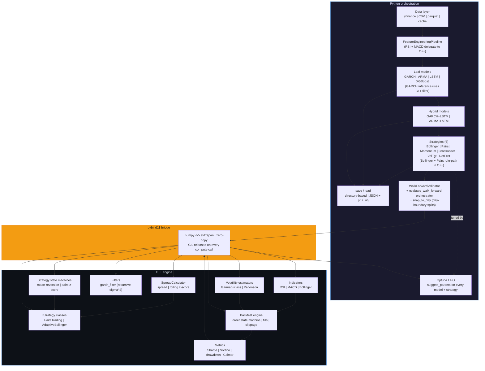
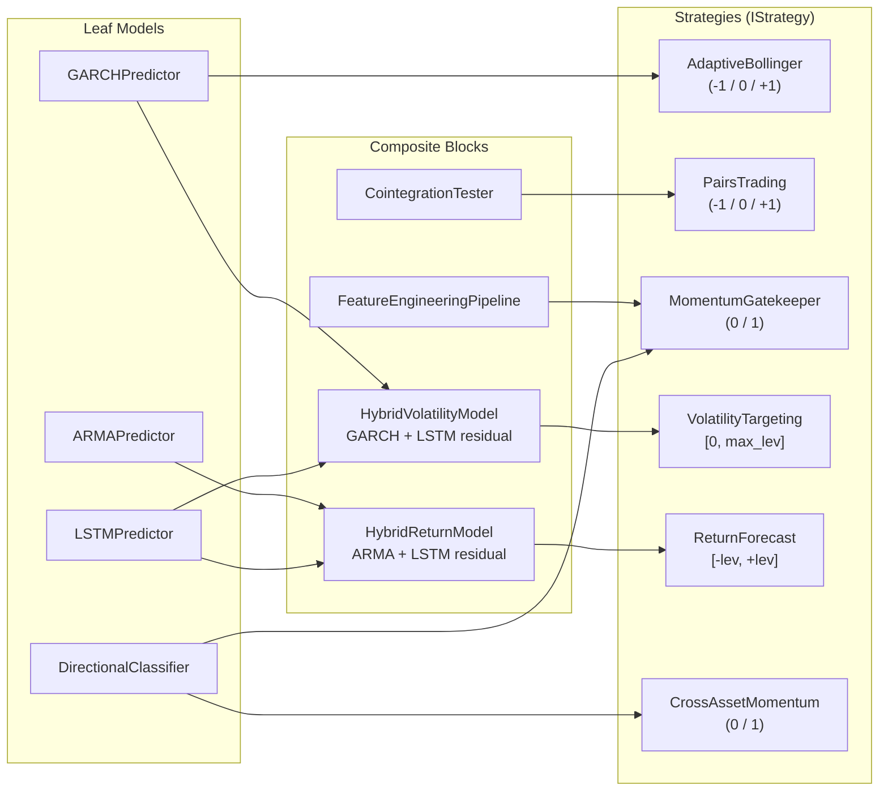
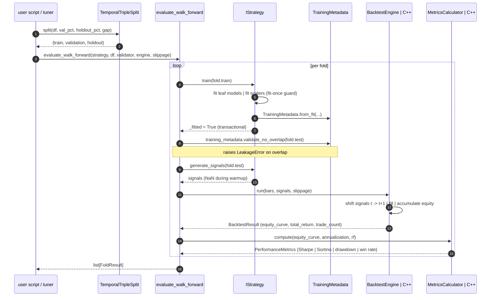
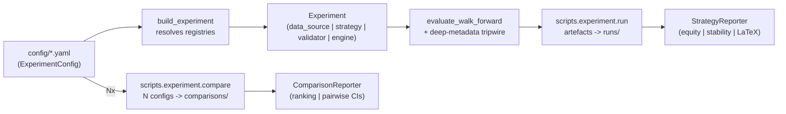
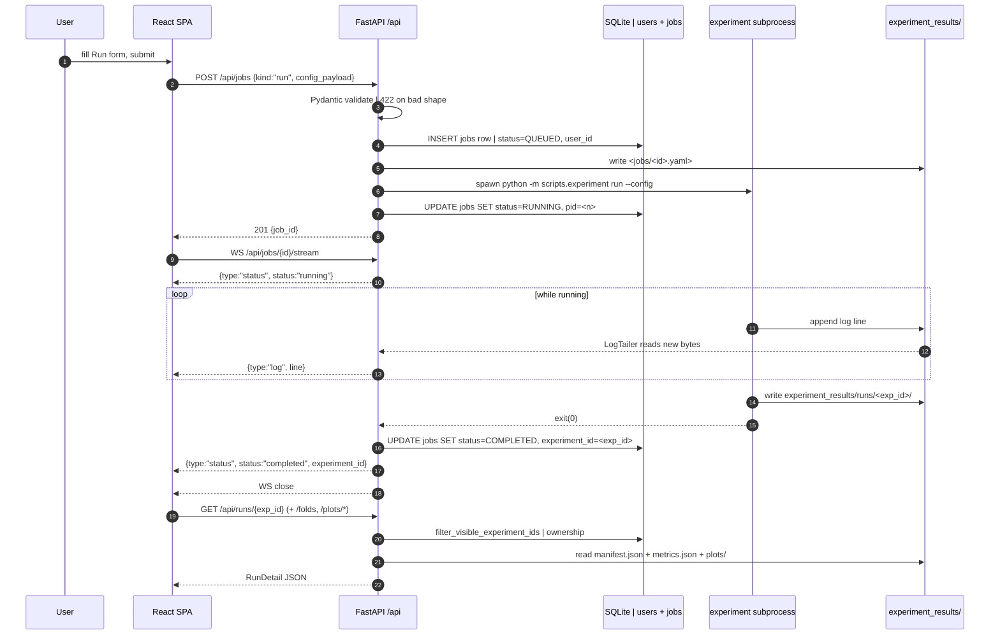

# Quant Trading Framework

[](https://github.com/Alextz307/quantforge/actions/workflows/ci.yml)

A thesis-grade, bifurcated C++/Python quantitative trading framework with strict anti-leakage guarantees, temporal contracts, and a clean separation between computation (C++) and orchestration (Python). Built around walk-forward validation, typed interfaces, and end-to-end hyperparameter tuning.

**Current state:** a Python orchestration layer built on top of a C++ core. Implemented and under test: the typed temporal contracts, data layer, ML leaf models (GARCH, ARMA, LSTM, XGBoost), hybrid residual models, six trading strategies, the feature pipeline, a C++ indicator suite (RSI, MACD, Bollinger, Garman-Klass, Parkinson), a GARCH inference filter, two strategy state machines and two full `IStrategy` C++ classes (pairs trading + adaptive bollinger) with a shared `SpreadCalculator` primitive, and the C++ backtest engine + performance metrics, all bridged through a `pybind11` module (`quant_engine`) with the GIL released on every compute call. Every model and strategy round-trips through directory-based `save()` / `load()` (JSON configs + metadata + native binary weights, zero pickle). `WalkForwardValidator` supports an optional `snap_to_day` mode that keeps every train/test boundary on a daily close, honouring the intraday day-boundary rule. CI is green on Linux and macOS with `mypy --strict` clean on the full Python tree, and `ruff` clean across the whole repo.

## Architecture



Anything that runs inside the backtest hot loop (bar iteration, indicators, metrics) lives in C++ with `std::span`-based zero-copy interfaces. Anything that benefits from Python's ecosystem (pandas, PyTorch, XGBoost, Optuna) stays in Python. The bridge is crossed once per batch. Numpy arrays go in as contiguous C-order buffers and results come back the same way.

## Design Principles

- **Anti-leakage by construction.** No `.bfill()`, no `.fillna(0)`. Fit-once guards on scalers (a second `fit()` raises `LeakageError`), frozen params after `fit()` on GARCH and ARMA, `TrainingMetadata` populated on every model and checked at runtime by the backtest engine via `validate_no_overlap()`, and an intraday day-boundary rule so that even on hourly bars the training cutoff is always a daily close (enforced by `WalkForwardValidator(snap_to_day=True)` for intraday folds).
- **Temporal contracts.** `TemporalSplit`, `TemporalTripleSplit`, and `WalkForwardValidator` enforce train-then-test ordering with embargo gaps. The holdout set is reserved for final thesis evaluation and is never touched during development or HPO.
- **Strict typing.** `mypy --strict` across `src/`, `tests/`, and `scripts/`. No `Any` at internal boundaries. `**kwargs: object` rather than `**kwargs: Any`. Public APIs use pure `Enum` types, not `Enum | str` weak unions. CI enforces this on every push.
- **Performance in the hot loop.** C++ uses `std::span<const double>` interfaces, SoA layouts, and Welford's algorithm for rolling mean/std fused in one pass. Every hot-path indicator, metric, engine, and strategy exposes both an allocating convenience overload and a buffer-reuse (`out`-param / `Buffer&`) overload so HPO inner loops reuse scratch across scenarios. `TimeSeries::slice_view` returns a non-owning `std::span` for zero-copy walk-forward splitting. Pybind11 bindings emit zero-copy numpy views over C++-owned buffers via pybind11 `py::capsule` and `handle base` ownership, with no `memcpy` at the Python<->C++ boundary. Release builds compile with `-O3 -march=native -flto`; rolling kernels are `noexcept` to unblock inlining + vectorization.
- **Registry-driven composition.** Every model, data source, and strategy registers via a decorator, which will let a future config loader instantiate an entire pipeline from a YAML file.
- **Drift guards over review vigilance.** Two sources of truth that must stay aligned (pyproject deps <-> CI pip install, composite dataclass fields <-> leaf ctor signature, Python `Interval` constants <-> C++ `kTradingDaysPerYear`) get an automated stdlib-only script in `scripts/` plus a pytest, wired into the CI lint job as an early step.

## Model Composition

Every strategy is a composition of typed, independently-tested building blocks. Leaf models are swappable; a C++ port of any leaf automatically benefits every composite that depends on it.



## Training and Backtest Flow



The holdout split is reserved for the final thesis evaluation - it is never touched during development or HPO. `TrainingMetadata.validate_no_overlap()` is a runtime tripwire that lives in the orchestrator (`evaluate_walk_forward`), not in the engine itself: `engine.run()` is a pure number cruncher and does not inspect training metadata. Direct callers of `engine.run()` are responsible for their own data hygiene - the orchestrator is the recommended entry point precisely because it wires the tripwire in for free.

## Orchestration flow

The orchestration layer turns a validated YAML config into a fully-wired
`Experiment`, drives the walk-forward, and routes results to the
matching reporter. Two CLI subcommands compose the full surface: one
config feeds `experiment run`, N configs feed `experiment compare`.



`Experiment` is a frozen bundle - every component is resolved once via
the global registries (`data_source_registry`, `strategy_registry`,
`feature_registry`) so the same YAML configures both ad-hoc runs and
HPO trials. The deep metadata tripwire then enforces strict no-overlap
between every component's training window and each fold's test window.

## Webapp

The framework also ships with a thin FastAPI + React webapp under
[`webapp/`](webapp/README.md) that puts a configurable runner and an
artifact viewer in front of the same CLI everyone uses. **The backend
never re-implements strategy logic** - it spawns the existing
`python -m scripts.experiment` subcommands as subprocesses and reads the
predictable artifact tree under `experiment_results/`, so whatever runs
from the UI is bit-identical to the equivalent shell invocation and a
missing UI button is never the reason a CLI flow is unreachable. A
single SQLite file under `webapp/data/` tracks users + jobs; artifact
ownership is read from the `jobs.user_id` <-> `experiment_id` mapping so
a non-admin only sees runs they launched. Auth is bcrypt + signed
HttpOnly cookies (`itsdangerous`) with `USER` / `ADMIN` roles. The
OpenAPI 3.1 spec is committed
(`webapp/frontend/openapi.snapshot.json`) and a drift guard fails CI on
divergence; the React side regenerates its typed client from that same
snapshot. A second guard mirrors every Pydantic write-DTO into a zod
schema so client-side form validation matches server-side validation
exactly.



End-to-end capabilities:

- **Run + tune + compare + holdout-eval** through one `POST /api/jobs`
  endpoint with a `kind` discriminator; the same Pydantic schemas
  validate both the React form and the backend payload.
- **Live log streaming + status transitions** over a single WebSocket
  frame channel (`{type:"log"|"status"}`); the HPO monitor uses the
  same pattern (`{type:"trial"}` frames as Optuna writes them).
- **Artifact browsers** for runs / comparisons / holdout evals /
  studies / HPO studies, each with detail + plot routes; admins can
  pass `?all=1` for a cross-user view.
- **Ownership-aware queries** on every read; non-owners receive 404
  (not 403) so artifact existence is not disclosed.
- **Soft-delete on users** with a regression test pinning
  reactivate-on-collision: a deleted user re-created with the same
  username keeps the same `user_id`, so their owned artifacts stay
  attributed.

## What's Implemented

### C++ engine (`cpp/`)
- **Core types.** `Bar`, `BarSoA`, `Signal`, `BacktestResult`, `Interval` enum with annualization factors, tagged series for train/test provenance.
- **Indicator framework.** `IIndicator` for single-array inputs and `IVolatilityEstimator` for OHLC four-span inputs. Multi-output indicators expose both a fast-path `compute()` returning the primary output and a richer `compute_all()` returning a result struct.
- **Indicators.** RSI (Wilder smoothing), MACD (EMA fast/slow/signal + histogram), Bollinger Bands (SMA +/- k*sigma with Welford rolling std).
- **Volatility estimators.** Garman-Klass and Parkinson, sharing `detail/` helpers for annualized rolling variance and OHLC length validation.
- **Backtest engine.** Bar-iteration loop with t->t+1 fill convention, position carry-forward, commission on turnover notional, NaN-signal-as-flat semantics, and an `allow_short` toggle. Slippage is pluggable: `NoSlippage`, `Fixed` (bps), and `VolumeScaled` (bps + volume-impact coefficient).
- **Performance metrics.** `MetricsCalculator` computes Sharpe, Sortino (downside), max drawdown, Calmar, win rate, annualized return + volatility from an equity curve. Single-pass Welford for mean/std; degenerate inputs return 0 rather than NaN.
- **GARCH inference filter.** `quant::filters::garch_filter(scaled_returns, GarchParams)` runs the recursive sigma^2 recurrence (`sigma^2[t] = omega + sum alpha_i*(r-mu)^2 + sum beta_j*sigma^2`) with backcast substitution and a variance floor. Called by `GARCHPredictor.predict()` - the `arch`-library fit loop stays in Python, only inference moves to C++.
- **Strategy state machines.** `run_mean_reversion_state_machine(close, mid, upper, lower, trend_ma)` and `run_pairs_state_machine(zscore, entry, exit, stop)` - bar-by-bar position carry with NaN skipping, returned as numpy arrays.
- **`SpreadCalculator` primitive.** `compute_spread(a, b, hedge_ratio)` and `compute_zscore(spread, window)` (Welford rolling, NaN on leading warmup and zero-variance windows). Consumed by `PairsTradingStrategy`.
- **Full `IStrategy` C++ classes.** `PairsTradingStrategy` fuses `SpreadCalculator` + pairs state machine behind a keyword-ctor `Config`; `AdaptiveBollingerStrategy` fuses rolling mid/trend + mean-reversion state machine. Both release the GIL on every `generate_signals`. Momentum, ReturnForecast, and VolatilityTargeting remain Python-native - their signal logic is dominated by ML inference, so C++ ports give no measurable speedup.
- **GoogleTest suite** covering correctness, slippage variants, fill convention, filter recurrence, state-machine transitions, spread + rolling z-score parity, C++ strategy classes, buffer-reuse overload parity, `slice_view` pointer-identity, fused-pass parity against pre-fusion references (MACD EMAs, Bollinger rolling mean+std, metrics Welford, spread Welford z-score), and numerical edge cases; builds on Linux and macOS through the CI matrix.

### Bridge + Python engine layer (`src/quant_engine/`, `src/engine/`)
- **pybind11 module `quant_engine`.** Exposes `BacktestEngine`, `MetricsCalculator`, `SlippageConfig`, `SlippageModel`, `BacktestResult`, `PerformanceMetrics`, the five indicators (`RSI`, `MACD` + `MACDResult`, `BollingerBands` + `BollingerResult`, `Parkinson`, `GarmanKlass`), the `GarchParams` struct + `garch_filter` free function, the two state machines (`run_mean_reversion_state_machine`, `run_pairs_state_machine`), `SpreadCalculator` + `CointegrationParams`, and the two full strategy classes (`PairsTradingStrategy` + its `Config`, `AdaptiveBollingerStrategy` + its `Config`). Every compute method declares `py::call_guard<py::gil_scoped_release>()` so Python-side parallelism (Optuna HPO, pytest-xdist) can actually scale. Stubs are checked in (`src/quant_engine/quant_engine.pyi`) so `mypy --strict` sees the binding.
- **`CppBacktestEngine` adapter.** Implements `IBacktestEngine`. Validates the pandas-shaped contract (DatetimeIndex, OHLCV columns present, signals index aligned with bars index) before dispatching to the binding. Supports `run_scenarios` for single-pass scenario sweeps.
- **`COST_SCENARIOS` / `SLIPPAGE_SCENARIOS`.** Named cost tiers keyed by `SlippageScenario` (`ZERO`, `LOW`, `NORMAL`, `HIGH`), each bundling a `SlippageConfig` with a per-turnover `commission_bps`. `SLIPPAGE_SCENARIOS` is the derived slippage-only view.
- **`evaluate_walk_forward` orchestrator.** Loops over `WalkForwardValidator` folds, retrains the strategy per fold, runs `validate_no_overlap()` as a runtime tripwire, and returns a list of `FoldResult` carrying both the raw `BacktestResult` and the `PerformanceMetrics`.

### Python ML layer (`src/`)
- **Leaf models.** `GARCHPredictor` (AIC grid search, params frozen post-fit, inference loop delegates to C++ `garch_filter`), `ARMAPredictor` (`pmdarima.auto_arima`, order and coefficients frozen; on reload reconstructed as a statsmodels `ARIMA` with the fitted order so `pmdarima` is a fit-time tool only), `MarketLSTM` + `LSTMPredictor` (configurable loss, temporal 80/20 validation split, early stopping, device auto-select), `DirectionalClassifier` (XGBoost binary direction). Every leaf implements `save(path)` / `load(path)` round-trip (JSON config + metadata, native binary weights for torch / XGBoost).
- **Hybrid residual models.** `HybridVolatilityModel` (GARCH + LSTM residual correction -> conditional variance) and `HybridReturnModel` (ARMA + LSTM residual correction -> conditional mean). Strict black-box composition - the leaves' anti-leakage guarantees are preserved at the composite level for free. `save` / `load` recurse into each leaf under `<root>/{garch,arma,lstm}/` subdirectories plus a root `scaler.json`.
- **Feature pipeline.** `FeatureEngineeringPipeline` produces log returns, RSI, MACD (+ signal and histogram), rolling volatility, MA ratio, and short/long return features. RSI and MACD delegate to the `quant_engine` bindings (Wilder smoothing for RSI, single-pass EMA fast/slow/signal for MACD). Every period is a ctor parameter and appears in `suggest_params`.
- **Cointegration.** `CointegrationTester` implements the Engle-Granger two-step procedure with hedge ratio and spread statistics.
- **Strategies.** All implement `IStrategy` with `train()` + `generate_signals()` + `save()` + `load()` + `suggest_params()`:
  - `AdaptiveBollingerStrategy` - mean-reversion bands scaled by GARCH forecast volatility, gated by a trend filter; the whole rule path (rolling mid, trend MA, position carry) runs in C++ via `quant_engine.AdaptiveBollingerStrategy`.
  - `PairsTradingStrategy` - Engle-Granger cointegrated spread z-score with configurable entry, exit, and stop-loss thresholds; the whole rule path (spread, rolling z-score, state machine) runs in C++ via `quant_engine.PairsTradingStrategy` with cached `CointegrationParams`.
  - `MomentumGatekeeperStrategy` - XGBoost directional classifier on the feature pipeline output, gated by a trend filter.
  - `CrossAssetMomentumStrategy` - XGBoost directional classifier over lagged returns of N feature tickers, trading a single primary asset from a wide `<ohlcv>_<TICKER>` frame.
  - `VolatilityTargetingStrategy` - hybrid volatility forecast driving continuous leverage, with bearish-regime attenuation. Realized-vol training target is the annualized Garman-Klass OHLC estimator computed via `quant_engine.GarmanKlass`.
  - `ReturnForecastStrategy` - hybrid return forecast driving a bounded continuous position.
  Strategy persistence delegates to the owned leaves (e.g. `<root>/classifier/` for Momentum, `<root>/hybrid_vol/` for VolatilityTargeting) with a root `config.json` + `metadata.json`.

### Infrastructure
- **Device selection** (`src/core/device.py`). Auto-picks CUDA > MPS > CPU for PyTorch and CUDA > CPU for XGBoost (MPS is explicitly rejected). Every model accepts `device: Device | None`. On `load()`, device is re-resolved against the current environment - `.pt` weights are loaded with `map_location` set to the host device rather than trusting the stored device string.
- **Temporal infrastructure.** `TemporalSplit`, `TemporalTripleSplit`, `WalkForwardValidator`, `TrainingMetadata` with `from_fit()` / `to_dict()` / `from_dict()` and runtime overlap validation. `WalkForwardValidator` accepts `snap_to_day: bool = False`; when true, every fold's `train_end` snaps back to a day close and `test_start` is pushed forward by `gap` **trading days** (not bars), so intraday walk-forward folds never straddle a day boundary.
- **Persistence layout** (`src/core/persistence.py`). Directory-based: `<root>/config.json`, `<root>/metadata.json` (from `TrainingMetadata.to_dict()`), and model-specific weight files - `weights.json` for GARCH and ARMA, `weights.pt` for LSTM, `model.ubj` for XGBoost, `scaler.json` for `StandardScaler`. No pickle, no joblib. `ensure_model_dir` refuses non-empty targets so a stale directory never silently shadows a fresh save.
- **Data layer.** `CSVSource`, `DataNormalizer` (handles both yfinance and polygon column conventions), `DataCache`, and a `validate_bars` ingestion-time quality check (NaN, non-positive prices, OHLC ordering, duplicate timestamps) that runs once per fetch before the cache write so bad data never reaches the strategies or the C++ engine.
- **Registries.** `model_registry`, `classifier_registry`, `strategy_registry`, `data_source_registry`.

## Getting Started

### Prerequisites

- **C++:** CMake 3.20+ and a C++20 compiler (Clang 15+, GCC 12+, or Apple Clang 14+).
- **Python:** 3.12 or newer.
- **macOS only:** `brew install libomp` (XGBoost wheels need OpenMP runtime).

### Clone and install

```bash
git clone git@github.com:Alextz307/quantforge.git
cd quantforge

# Python package in editable mode, plus dev tools (mypy, ruff, pytest)
pip install -e ".[dev]"

# C++ build - CMake FetchContent pulls GoogleTest and pybind11
cmake -B cpp/build -S cpp -DCMAKE_BUILD_TYPE=Debug
cmake --build cpp/build -j
```

### Run the tests

```bash
make test           # Full gate: C++ ctest + pytest + mypy strict
make test-cpp       # GoogleTest suite
make test-python    # pytest suite
make typecheck      # mypy --strict src/ tests/ scripts/
make lint           # ruff check + ruff format --check
```

### Minimal example - fit a strategy and generate signals

```python
from src.strategies.adaptive_bollinger import AdaptiveBollingerStrategy
from tests.conftest import make_synthetic_close_df

train = make_synthetic_close_df(n_rows=500)
eval_df = make_synthetic_close_df(n_rows=100, start="2021-01-04", seed=99)

strategy = AdaptiveBollingerStrategy(window=20, k=2.0, trend_window=100)
strategy.train(train)
signals = strategy.generate_signals(eval_df)      # pd.Series in {-1, 0, +1}

strategy.save("/tmp/ab_model")                    # metadata + config + GARCH subdir
reloaded = AdaptiveBollingerStrategy.load("/tmp/ab_model")
# reloaded.generate_signals(eval_df) is bit-identical to strategy.generate_signals(eval_df)
```

Every strategy exposes the same four-verb API - `train(data)`, `generate_signals(data)`, `save(path)`, `load(path)` - plus a static `suggest_params(trial)` so Optuna can tune the entire stack (feature periods, model hyperparameters, and strategy thresholds) end to end.

## Project Structure

```
cpp/
  include/quant/
    core/                Bar, TimeSeries, Interval, tagged series
    indicators/          IIndicator, IVolatilityEstimator, RSI, MACD, Bollinger, GK, Parkinson
    indicators/detail/   Shared helpers (Welford rolling, annualization)
    filters/             garch_filter (GARCH inference sigma^2 recurrence)
    statistics/          SpreadCalculator (spread + rolling z-score, shared by pairs)
    strategies/          IStrategy mixin, state machines, PairsTradingStrategy, AdaptiveBollingerStrategy
    engine/              SlippageConfig, BacktestEngine
    metrics/             MetricsCalculator, PerformanceMetrics
  src/                   Implementation files
  bindings/              pybind11 module entry point (python_module.cpp)
  tests/                 GoogleTest suite

src/
  core/                  Types, constants, temporal contracts, registry, device selection, exceptions, persistence helpers, config schema
  data/                  Sources (yfinance, CSV, parquet), normalizer, cache, loader, fingerprint
  features/              FeatureEngineeringPipeline
  models/                GARCH, ARMA, LSTM, XGBoost classifier, hybrids, cointegration, dataset (each with save / load)
  strategies/            Six strategies + IStrategy interface (each with save / load)
  engine/                CppBacktestEngine adapter, cost scenarios, walk-forward orchestrator
  quant_engine/          pybind11 module re-exports + checked-in mypy stubs
  orchestration/         Builder, Experiment + RunOptions, comparison, manifest, deployment, holdout-eval, study orchestrator + report, clean
  optimization/          Optuna StrategyTuner + samplers / pruners / objectives + checkpointing
  analysis/              Fold aggregator, ranking, paired-bootstrap significance
  visualization/         Strategy / Comparison / HPO reporters (plots + booktabs LaTeX)

tests/
  unit/                  One unit-test file per component
  integration/           pybind11 module load + engine/indicator/filter/state-machine binding parity + walk-forward orchestrator
  fixtures/              Committed offline fixtures (e.g. SPY.parquet)
  conftest.py            Shared fixtures (synthetic data, global seeds)

scripts/                 experiment CLI + stdlib-only drift guards
config/                  Strategy / HPO / universe YAMLs
experiment_results/
  runs/, comparisons/, hpo/, studies/, models/  Ephemeral per-developer artefacts (gitignored)
.github/workflows/ci.yml Lint, typecheck, C++ matrix, Python matrix
Makefile                 Canonical build/test entry points
pyproject.toml           Python deps + scikit-build-core config
mypy.ini                 Strict settings + per-module ignore_missing_imports
```

### Subsystem navigation

Each subsystem ships its own `README.md` - purpose, public surface,
layout table, one runnable snippet, and cross-links. Use these as
navigation aids; function signatures and detailed docstrings live in the
code.

- [`cpp/`](cpp/README.md) - C++20 engine: indicators, filters, state machines, backtest engine, metrics, pybind11 module.
- [`src/orchestration/`](src/orchestration/README.md) - config -> wired experiment, walk-forward driver, comparison + holdout pipelines.
- [`src/strategies/`](src/strategies/README.md) - `IStrategy` + the six concrete strategies (incl. pairs + cross-asset).
- [`src/engine/`](src/engine/README.md) - `CppBacktestEngine` adapter + walk-forward orchestrator (single-leg / pairs dispatch).
- [`src/features/`](src/features/README.md) - `FeatureEngineeringPipeline` + fit-once anti-leakage scaler.
- [`src/optimization/`](src/optimization/README.md) - Optuna `StrategyTuner` + samplers / pruners / objectives.
- [`src/data/`](src/data/README.md) - sources, normaliser, cache, fingerprint (single + pair).
- [`src/core/`](src/core/README.md) - types, constants, registry, temporal primitives, persistence layout, exceptions, config.
- [`src/models/`](src/models/README.md) - leaf predictors / classifiers / hybrids / cointegration / dataset.
- [`src/analysis/`](src/analysis/README.md) - fold aggregator, ranking, significance.
- [`src/visualization/`](src/visualization/README.md) - strategy / comparison / HPO reporters.
- [`scripts/`](scripts/README.md) - `experiment` CLI and drift guards.
- [`config/`](config/README.md) - strategy / HPO / model / universe YAMLs.
- [`webapp/`](webapp/README.md) - FastAPI backend + React/Vite SPA: read-only artifact viewer, configurable runner (run + tune), live job + HPO monitors with WebSocket streaming.

## Tech Stack

| Layer     | Technology                                                                                       |
|-----------|--------------------------------------------------------------------------------------------------|
| C++ engine| C++20, CMake 3.20+, GoogleTest                                                                    |
| Python    | pandas 2.2+, numpy 1.26+, Pydantic v2, PyTorch 2.2+, XGBoost 2.x, arch, statsmodels, pmdarima, scikit-learn, Optuna |
| Bridge    | pybind11 2.12+, scikit-build-core                                                                |
| Quality   | mypy (strict), ruff (check + format), pandas-stubs, ASan/UBSan-ready C++ flags                   |
| CI        | GitHub Actions on an `ubuntu-latest` and `macos-latest` matrix                                   |

## License

This project is part of a university thesis. Not licensed for redistribution.
