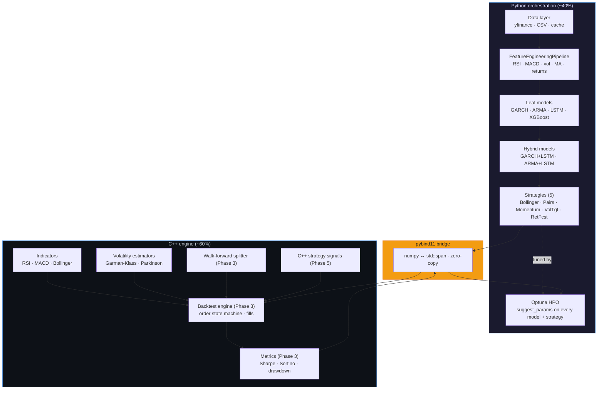
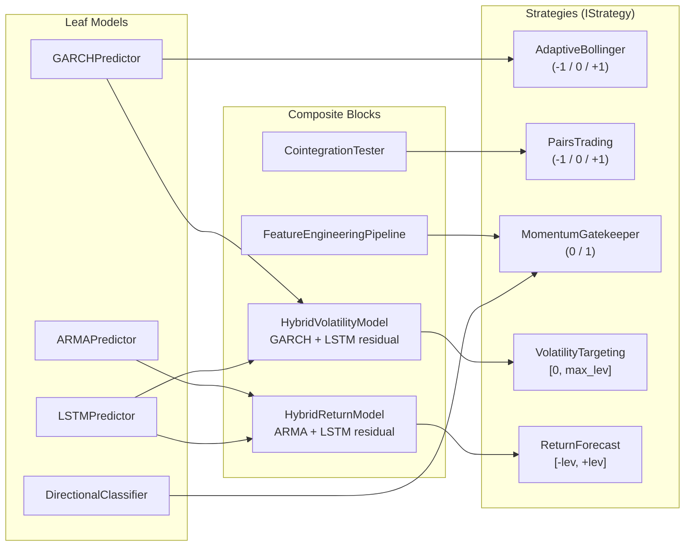
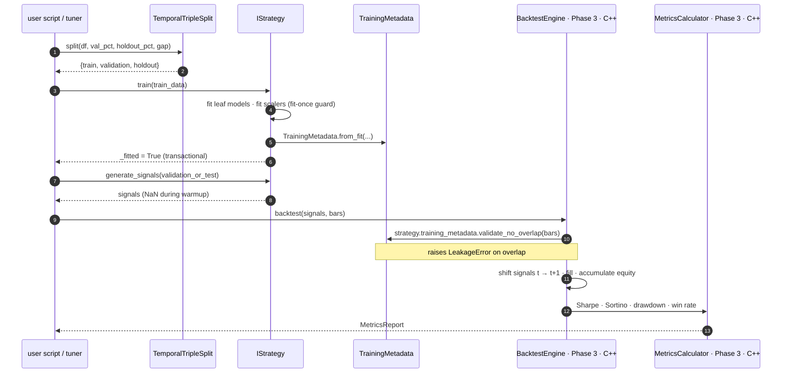
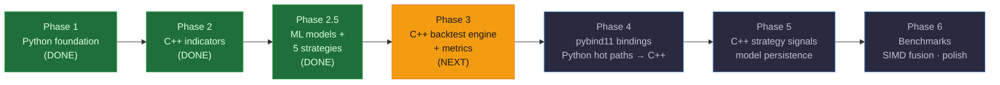

# Quant Trading Framework

A thesis-grade, bifurcated C++/Python quantitative trading framework with strict anti-leakage guarantees, temporal contracts, and a clean separation between computation (C++) and orchestration (Python). Built around walk-forward validation, typed interfaces, and end-to-end hyperparameter tuning.

**Current state:** Python foundation, C++ indicators, ML leaf models, hybrid residual models, and five trading strategies are implemented and under test. CI is green on Linux and macOS with **332 Python tests**, **100 C++ tests**, `mypy --strict` clean on 70 source files, and `ruff` clean across the whole repo. The C++ backtesting engine (Phase 3) is the next milestone.

## Architecture



Anything that runs inside the backtest hot loop (bar iteration, indicators, metrics) lives in C++ with `std::span`-based zero-copy interfaces. Anything that benefits from Python's ecosystem (pandas, PyTorch, XGBoost, Optuna) stays in Python. The bridge is crossed once per batch — numpy arrays go in as contiguous C-order buffers and results come back the same way.

## Design Principles

- **Anti-leakage by construction.** No `.bfill()`, no `.fillna(0)`. Fit-once guards on scalers (a second `fit()` raises `LeakageError`), frozen params after `fit()` on GARCH and ARMA, `TrainingMetadata` populated on every model and checked at runtime by the backtest engine via `validate_no_overlap()`, and an intraday day-boundary rule so that even on hourly bars the training cutoff is always a daily close.
- **Temporal contracts.** `TemporalSplit`, `TemporalTripleSplit`, and `WalkForwardValidator` enforce train-then-test ordering with embargo gaps. The holdout set is reserved for final thesis evaluation and is never touched during development or HPO.
- **Strict typing.** `mypy --strict` across `src/`, `tests/`, and `scripts/`. No `Any` at internal boundaries. `**kwargs: object` rather than `**kwargs: Any`. Public APIs use pure `Enum` types — no `Enum | str` weak unions. CI enforces this on every push.
- **Performance-ready, not premature.** C++ uses `std::span<const double>` interfaces, SoA layouts, Welford's algorithm for rolling std, and precomputed annualization factors. Every known optimization candidate (EMA fusion, rolling-mean-std fusion, zero-copy slicing) is cataloged as a `TODO(Phase 6)` marker; nothing is optimized speculatively.
- **Registry-driven composition.** Every model, data source, and strategy registers via a decorator. Phase 5/6 will instantiate an entire pipeline from a YAML config.
- **Drift guards over review vigilance.** Two sources of truth that must stay aligned (pyproject deps ↔ CI pip install, composite dataclass fields ↔ leaf ctor signature, Python `Interval` constants ↔ C++ `kTradingDaysPerYear`) get an automated stdlib-only script in `scripts/` plus a pytest, wired into the CI lint job as an early step.

## Model Composition

Every strategy is a composition of typed, independently-tested building blocks. Leaf models are swappable; a Phase 4 C++ port of any leaf automatically benefits every composite that depends on it.



## Training and Backtest Flow



The holdout split is reserved for the final thesis evaluation — it is never touched during development or HPO. `TrainingMetadata.validate_no_overlap()` is a runtime tripwire: if a caller accidentally passes training data as evaluation data, the backtest engine refuses to run.

## What's Implemented

### C++ engine (`cpp/`)
- **Core types.** `Bar`, `TimeSeries`, `Interval` enum with annualization factors, tagged series for train/test provenance.
- **Indicator framework.** `IIndicator` for single-array inputs and `IVolatilityEstimator` for OHLC four-span inputs. Multi-output indicators expose both a fast-path `compute()` returning the primary output and a richer `compute_all()` returning a result struct.
- **Indicators.** RSI (Wilder smoothing), MACD (EMA fast/slow/signal + histogram), Bollinger Bands (SMA ± k·σ with Welford rolling std).
- **Volatility estimators.** Garman-Klass and Parkinson, sharing `detail/` helpers for annualized rolling variance and OHLC length validation.
- **100 GoogleTest cases** covering correctness and numerical edge cases; builds on Linux and macOS through the CI matrix.

### Python ML layer (`src/`)
- **Leaf models.** `GARCHPredictor` (AIC grid search, params frozen post-fit), `ARMAPredictor` (`pmdarima.auto_arima`, order and coefficients frozen), `MarketLSTM` + `LSTMPredictor` (configurable loss, temporal 80/20 validation split, early stopping, device auto-select), `DirectionalClassifier` (XGBoost binary direction).
- **Hybrid residual models.** `HybridVolatilityModel` (GARCH + LSTM residual correction → conditional variance) and `HybridReturnModel` (ARMA + LSTM residual correction → conditional mean). Strict black-box composition — the leaves' anti-leakage guarantees are preserved at the composite level for free.
- **Feature pipeline.** `FeatureEngineeringPipeline` produces log returns, RSI, MACD (+ signal and histogram), rolling volatility, MA ratio, and short/long return features. Every period is a ctor parameter and appears in `suggest_params`.
- **Cointegration.** `CointegrationTester` implements the Engle-Granger two-step procedure with hedge ratio and spread statistics.
- **Strategies.** All implement `IStrategy` with `train()` + `generate_signals()` + `suggest_params()`:
  - `AdaptiveBollingerStrategy` — mean-reversion bands scaled by GARCH forecast volatility, gated by a trend filter; two-pass state machine (vectorized detection, tight state-carry loop).
  - `PairsTradingStrategy` — Engle-Granger cointegrated spread z-score with configurable entry, exit, and stop-loss thresholds.
  - `MomentumGatekeeperStrategy` — XGBoost directional classifier on the feature pipeline output, gated by a trend filter.
  - `VolatilityTargetingStrategy` — hybrid volatility forecast driving continuous leverage, with bearish-regime attenuation.
  - `ReturnForecastStrategy` — hybrid return forecast driving a bounded continuous position.

### Infrastructure
- **Device selection** (`src/core/device.py`). Auto-picks CUDA > MPS > CPU for PyTorch and CUDA > CPU for XGBoost (MPS is explicitly rejected). Every model accepts `device: Device | None`.
- **Temporal infrastructure.** `TemporalSplit`, `TemporalTripleSplit`, `WalkForwardValidator`, `TrainingMetadata` with `from_fit()` / `to_dict()` / `from_dict()` and runtime overlap validation.
- **Data layer.** `CSVSource`, `DataNormalizer` (handles both yfinance and polygon column conventions), `DataCache`.
- **Registries.** `model_registry`, `classifier_registry`, `strategy_registry`, `data_source_registry`.

## Getting Started

### Prerequisites

- **C++:** CMake 3.20+ and a C++20 compiler (Clang 15+, GCC 12+, or Apple Clang 14+).
- **Python:** 3.12 or newer.
- **macOS only:** `brew install libomp` (XGBoost wheels need OpenMP runtime).

### Clone and install

```bash
git clone git@github.com:Alextz307/quantforge.git
cd quantforge

# Python package in editable mode, plus dev tools (mypy, ruff, pytest)
pip install -e ".[dev]"

# C++ build — CMake FetchContent pulls GoogleTest, Google Benchmark, and pybind11
cmake -B cpp/build -S cpp -DCMAKE_BUILD_TYPE=Debug
cmake --build cpp/build -j
```

### Run the tests

```bash
make test           # Full gate: C++ ctest + pytest + mypy strict
make test-cpp       # 100 GoogleTest cases
make test-python    # 332 pytest cases
make typecheck      # mypy --strict src/ tests/ scripts/
make lint           # ruff check + ruff format --check
make bench-cpp      # Google Benchmark indicator micro-benches
```

### Minimal example — fit a strategy and generate signals

```python
from src.strategies.adaptive_bollinger import AdaptiveBollingerStrategy
from tests.conftest import make_synthetic_close_df

train = make_synthetic_close_df(n_rows=500)
eval_df = make_synthetic_close_df(n_rows=100, start="2021-01-04", seed=99)

strategy = AdaptiveBollingerStrategy(window=20, k=2.0, trend_window=100)
strategy.train(train)
signals = strategy.generate_signals(eval_df)      # pd.Series in {-1, 0, +1}
```

Every strategy exposes the same three-verb API — `train(data)`, `generate_signals(data)`, `update(new_data)` — plus a static `suggest_params(trial)` so Optuna can tune the entire stack (feature periods, model hyperparameters, and strategy thresholds) end to end.

## Project Structure

```
cpp/
  include/quant/
    core/                Bar, TimeSeries, Interval, tagged series
    indicators/          IIndicator, IVolatilityEstimator, RSI, MACD, Bollinger, GK, Parkinson
    indicators/detail/   Shared helpers (Welford rolling, annualization)
  src/                   Implementation files
  tests/                 GoogleTest suite
  benchmarks/            Google Benchmark micro-benches

src/
  core/                  Types, constants, temporal contracts, registry, device selection, exceptions
  data/                  Sources (CSV), normalizer, cache, loader
  features/              FeatureEngineeringPipeline
  models/                GARCH, ARMA, LSTM, XGBoost classifier, hybrids, cointegration, dataset
  strategies/            Five strategies + IStrategy interface
  engine/                Backtest engine interface (implementation in C++, Phase 3)
  optimization/          Reserved for HPO orchestration (Phase 6)
  visualization/         Reserved for plotting (Phase 6)
  benchmarking/          Reserved for benchmarking harness (Phase 6)

tests/
  unit/                  One unit-test file per component
  integration/           Reserved for end-to-end pipelines (Phase 4+)
  benchmarks/            Reserved for perf-regression tests (Phase 6)
  conftest.py            Shared fixtures (synthetic data, global seeds)

scripts/                 stdlib-only drift guards and utilities
config/                  YAML + Pydantic settings (populated in Phase 5)
.github/workflows/ci.yml Lint, typecheck, C++ matrix, Python matrix
Makefile                 Canonical build/test entry points
pyproject.toml           Python deps + scikit-build-core config
mypy.ini                 Strict settings + per-module ignore_missing_imports
```

## Roadmap



| Phase | Name                                                                                | Status       |
|------:|-------------------------------------------------------------------------------------|--------------|
|     1 | Python foundation: types, temporal contracts, registry, data layer                  | **Complete** |
|     2 | C++ foundation: core types, indicators, volatility estimators                       | **Complete** |
|   2.5 | ML leaf models, hybrids, feature pipeline, cointegration, five strategies           | **Complete** |
|     3 | C++ backtesting engine, performance metrics, walk-forward splitting in C++          | Next         |
|     4 | pybind11 bindings; Python hot paths replaced with C++ implementations               | Planned      |
|     5 | C++ strategy signal generation, model persistence, incremental `update()`           | Planned      |
|     6 | Benchmarking suite, SIMD fusion, profile-driven optimization                        | Planned      |

## Tech Stack

| Layer     | Technology                                                                                       |
|-----------|--------------------------------------------------------------------------------------------------|
| C++ engine| C++20, CMake 3.20+, GoogleTest, Google Benchmark                                                  |
| Python    | pandas 2.2+, numpy 1.26+, Pydantic v2, PyTorch 2.2+, XGBoost 2.x, arch, statsmodels, pmdarima, scikit-learn, Optuna |
| Bridge    | pybind11 2.12+, scikit-build-core                                                                |
| Quality   | mypy (strict), ruff (check + format), pandas-stubs, ASan/UBSan-ready C++ flags                   |
| CI        | GitHub Actions on an `ubuntu-latest` and `macos-latest` matrix                                   |

## License

This project is part of a university thesis. Not licensed for redistribution.
